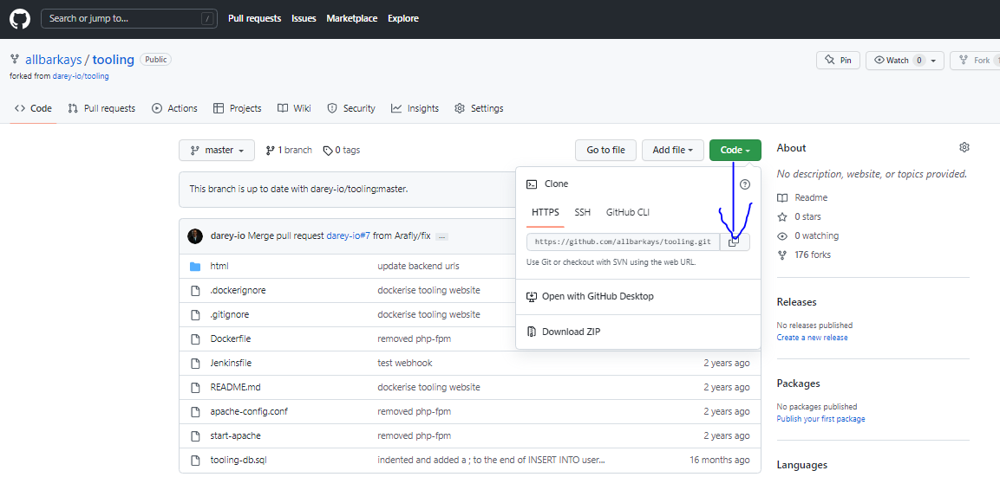
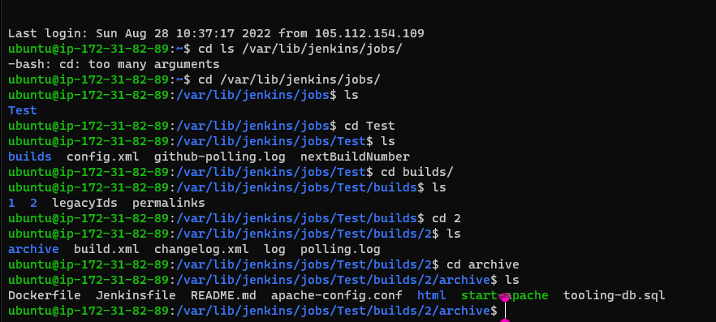
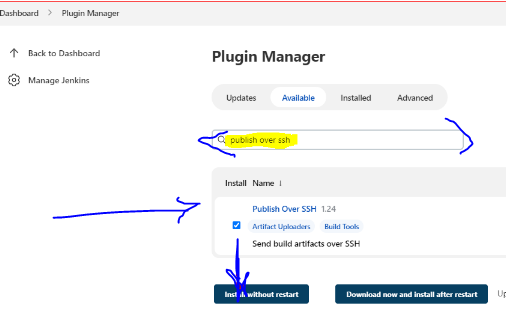

# INSTALL AND CONFIGURE JENKINS SERVER

## Step 1 – Install Jenkins server


* Spin up AWS EC2 server based on Ubuntu Server 20.04 LTS and named it "Jenkins9" with all TCP ports open


* Installed JDK (since Jenkins is a Java-based application)


sudo apt update
sudo apt install default-jdk-headless


* Installed Jenkins

```
wget -q -O - https://pkg.jenkins.io/debian-stable/jenkins.io.key | sudo apt-key add -

sudo sh -c 'echo deb https://pkg.jenkins.io/debian-stable binary/ > \
    /etc/apt/sources.list.d/jenkins.list'

sudo apt update

sudo apt-get install jenkins

```

* Checked to be sure ***Jenkins*** is up and running

`sudo systemctl status jenkins`


* Perform initial Jenkins setup.

From your browser access http://Jenkins-Server-Public-IP-Address-or-Public-DNS-Name:8080


* http://50.16.107.156:8080/

Immediately prompted to provide a default admin password

* I then retrieved it from the server:

`sudo cat /var/lib/jenkins/secrets/initialAdminPassword`

* Then take the following steps in the screenshots to set-up Jenkins


## Step 2 – Configure Jenkins to retrieve source codes from GitHub using Webhooks

Configure Jenkins job/project (these two terms can be used interchangeably). 

This job will will be triggered by ***GitHub webhooks*** and will execute a ***‘build’*** task to retrieve codes from GitHub and store it locally on Jenkins server.

* Enable webhooks in your GitHub repository settings


* Go to Jenkins web console, click "New Item" and create a "Freestyle project"


* To connect your GitHub repository, you will need to provide its URL, you can copy from the repository itself



* Create a user credential and save


* Click ***"Build Now"*** button, after configuring everything correctly, the build will be successfull and will show it under #1


* Click "Configure" your job/project and add these two configurations
Configure triggering the job from GitHub webhook:


Build-action.PNG

* Configure "Post-build Actions" to archive all the files – files resulted from a build are called "artifacts".


* I'll go ahead and make a change in ***READme.md*** file in the tooling repository my GitHub, commit and save the changes to the master branch.


* By default, the artifacts are stored on Jenkins server locally


`ls /var/lib/jenkins/jobs/tooling_github/builds/<build_number>/archive/`



* Now, we have confirgured an automated Job on Jenkins which is known as a ***PUSH***


## Step 3 – Configure Jenkins to copy files to NFS server via SSH

Now I have my artifacts saved locally on Jenkins server, the next step is to copy them to my NFS server to ***/mnt/apps*** directory to achieve this, I'll install this plugins ***"Publish over ssh"***

To install "Publish Over SSH" plugin

On main dashboard, Go to ***"Manage Jenkins" > "Manage Plugins" > "Available" tab then search for "Publish Over SSH" plugin and install it***




* Configure the job/project to copy artifacts over to NFS server.

On main dashboard, select ***"Manage Jenkins">"Configure System">Scroll down to Publish over SSH plugin configuration section*** and configure it to be able to connect to my NFS server:

Provide a private key (content of ***.pem file*** that was used to connect to NFS server via SSH/PUTTY) then click Add to continue SSH server configuration.


Scroll down to Publish over SSH plugin configuration section and configure it to be able to connect to your NFS server:

1. Provide a private key (content of .pem file that you use to connect to NFS server via SSH/Putty)
2. Arbitrary name
3. Hostname – can be private IP address of your NFS server
4. Username – ec2-user (since NFS server is based on EC2 with RHEL 8)
5. Remote directory – ***/mnt/apps*** since our Web Servers use it as a mointing point to retrieve files from the NFS server


NOTE: I ensured that permission that will allow my Jenkins user read, write and execute files on /mnt/apps directory to NFS-Server is set and owner permission on /mnt/apps directory is set to nobody.

```
sudo chown -R nobody: /mnt/apps

sudo chmod -R 777 /mnt/apps

sudo systemctl restart nfs-server.service

sudo systemctl status nfs-server.service

```


* Then, I made a change in ***README.md***  file in my GitHub Tooling repository and that immediately triggered a job in Jenkins as seen in ***#4*** below, ***#3*** failed because I did not have the required permission to make changes on the ***NFS*** server


* Then I checked the success output in console output as below:


* To make sure that the files in ***/mnt/apps*** was updated I connected via SSH/Putty to my NFS server and check README.MD file

`cat /mnt/apps/mnt/apps/README.md`


# PROJECT SUCCESSFUL ***!!!***


